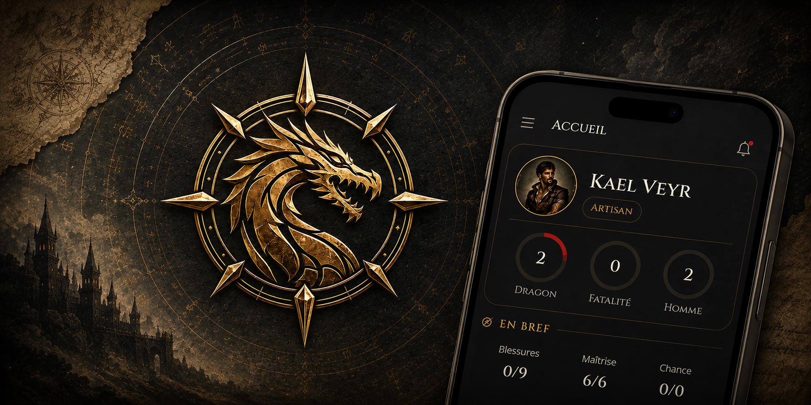

# Prophecy Companion App

A mobile companion app for the French tabletop RPG **Prophecy (2nd edition)**. Create, store, and play your characters from your phone — keep track of the things that change at the table so you can leave the paper sheet at home.

> The app's interface is in **French**, matching the Prophecy 2e rulebook and its terminology.

## What it does

Prophecy character sheets have a lot of moving parts. The app keeps two kinds of data apart under the hood:

- **The sheet** — the character you build: identity, *tendances*, *caractéristiques*, *attributs*, max health, resource pools, magic, skills, weapons, armor, shields, biography. Changes rarely.
- **The live values** — what changes during a session: current wounds, spent resources, initiative dice, magic reserve, money, temporary effects, conditions and notes.

Both live in the same screens: each tab has a **read mode** and a **live edit mode** (the floating pencil). Flip to edit to nudge values mid-combat; flip back to a clean glance. Edits save instantly and live-update across every screen. There's no separate "statut" screen anymore.

Everything is stored **locally on your device** (SQLite). No account, no cloud. The app works fully offline — the one exception is the optional **campaign mode** (see below), which sends a minimized, read-only extract of a character to a server your group chooses, and only when you explicitly share.

## Features

The app opens on your **character roster** — every character with name + concept. Tap **+** to create one; tap a character to open its five tabs: **Accueil**, **Fiche**, **Compétences**, **Inventaire**, **Magie**.

### Accueil — home dashboard
A glanceable, read-only landing:
- Identity header: avatar (tap to set from your photos), name, concept chip.
- The three **tendances** as ring gauges (Dragon, Fatalité, Homme).
- **En bref** vitals — total wounds taken vs max, and the Maîtrise / Chance pools.
- **Illustration** — an optional full portrait, collapsed by default.

### Fiche — the full sheet
Every stat, editable inline via the tab's pencil. The header pencil opens the full identity/maximums form (and lets you delete the character).
- **Tendances** — a triangle; in edit mode tap for +1, long-press for −1, and set the 0–10 *puces* subnumber.
- **Caractéristiques** — the 8 stats (Force, Résistance, Intelligence, Volonté, Coordination, Perception, Présence, Empathie).
- **Attributs** — Physique, Mental, Manuel, Social.
- Stat badges fold in the **live total modifier** — temporary effects plus the current wound malus.
- **Initiative** — per-die values for the current turn, with a roll-all button; a rolled die driven to 0 or below by the wound malus is flagged unusable.
- **Santé** — wound boxes per level (Égratignure → Mort), with each level's malus; tap boxes to fill/clear current damage.
- **Effets** — temporary bonuses / maluses (see below).
- **Armure** — the equipped armor's defense pool, tracked here.
- **Bouclier** — the equipped shield's defense pool, tracked here.
- **Ressources** — Maîtrise & Chance: spend −1 / restore +1 against their max, or refill.
- **Conditions** — free-text conditions & notes for the session.
- **Biographie** — free text.

### Effets — temporary bonus / malus system
Add an effect that targets **every roll**, a single caractéristique, or a single attribut, with a signed value and a duration counted in actions / rounds / hours / days. A **"temps écoulé"** control ticks down every effect sharing a time unit by one; expired effects are struck through but kept. Active effects fold automatically into the matching stat badges, alongside the wound malus.

### Compétences
Your skills, each linked to an attribut. Start from the built-in Prophecy 2e skill catalogue or add your own free-text skills. Skills at value 0 aren't kept. The search + attribut filter tabs sit at the bottom of the screen, within thumb reach.

### Inventaire — weapons, armor, shields & gear
- **Argent** — the four Drac coins (or, argent, bronze, fer), edited here.
- **Armes** — add from the **rulebook weapon catalogue** (the sword FAB) or build your own; the pencil opens the full editor. A weapon carries name, damage, prerequisites, effective & max range, two initiative modifiers (mêlée / corps à corps), creation difficulty & time, and free-text special effects.
  - **Formulas** — damage and ranges accept caractéristique-based formulas like `FOR x2 +3 +1D10`. Each card shows the formula *and* its computed result for the character (with Force 4 → `11 + 1D10`); dice stay unrolled. Effects and the wound malus are folded into the caractéristique before the multiplier.
  - **Prerequisites** like `FOR 4, COO 5` are checked against the character and flagged met/unmet.
- **Armures** — add from the **rulebook armor catalogue** (the shield FAB) or build your own. Carries a weight category (légère / moyenne / lourde), defense max, prerequisites, creation difficulty & time, a pénalité d'encombrement, and free-text special effects. Tap the tile to equip one armor at a time; **Réparer** refills defense — the equipped armor's live defense also shows on the Fiche.
- **Boucliers** — same idea as armor, but a shield can also strike: it carries a damage formula (like a weapon) alongside its own defense pool, prerequisites, creation and encombrement. Equip is independent of armor and of any weapon — one armor, one shield, and your weapons can all be equipped together.
- **Objets** — free-text inventory for anything that isn't a weapon/armor/shield (a rune, a potion, rope…): name, description, a stackable quantity, and a multi-slot equipped toggle (several objects can be worn/held at once). Searchable once you have more than a couple.

### Magie
- **Disciplines** — Invocatoire, Instinctive, Sorcellerie (plain stats, edited on the Fiche form).
- **Réserve** — the global magic reserve plus each known **sphère** (Cités, Feu, Métal, Nature, Océans, Pierre, Rêves, Vents, Ombre), tracked as bullet pools; a sphere appears once its max > 0.
- **Objets de réserve** — items holding their own magic puces (gemme, bâton, talisman). The section only shows up once the character owns one (or while editing, to add the first): **Ajouter un objet** asks a name and a number of puces. Each object is an independent pool spent by tapping its bullets, so the global reserve stays untouched. Tap an object's name to rename or re-size it, the bin to delete it.
- **Sortilèges** — add spells from the catalogue (the magic FAB) or your own. Each spell carries niveau, complexité, discipline, sphère, coût, incantation (temps + unité), difficulté, clé, and effet, editable in a modal.
- **Enchantements** — bind an enchantment to a weapon, armor, shield or object (a name, an optional linked spell that copies its effet, and a current/max charge count). Each card shows what it's bound to and whether that item is currently equipped; a small badge marks enchanted gear everywhere it's listed (Inventaire cards included).

### Backup & transfer
From the roster's **⋮** menu: **Exporter tout** writes every character to a JSON file (shared via the OS share sheet — save to Files, send to another device), and **Importer…** reads one back, adding its characters as new entries (never overwriting). Your safety net against device loss, and how you move a character between phones. *(Character illustrations aren't included in the export yet.)*

### Campagnes — live GM/player mode (optional)
Play together at a table (or remotely). From the roster header's **group** icon, open **Campagnes**:
- **The GM** creates a campaign on a **server** (a shared community instance or one your group self-hosts) and gets a **join code** + **QR code** to share. The **Salon** lists who's connected; **Ouvrir la Compagnie** shows the whole table at once — one card per player, switchable between **Attributs**, **Compétences** (searchable across everyone, with each skill's total and active modifier) and **Tendances**. Tap a card for the full read-only sheet, plus **private notes** that never leave the GM's phone.
- **A player** joins with the code (type it, or scan the GM's QR), picks which character to share, and taps **Diffuser**. From then on, changes to the character's *in-play* values (wounds, Maîtrise/Chance, tendances, conditions, initiative, active effects) stream to the GM in near real-time. A floating indicator shows you're broadcasting; **Arrêter** pauses it.

**Privacy by design.** Only a minimized extract is sent — **name, combat state, caractéristiques, attributs, tendances, trained skills, and active bonuses/maluses**. Never your biography, notes, money, magic, or untrained skills. The data lives on the chosen server under its host's responsibility (community instance or self-hosted); stopping the share or leaving the campaign erases it. See [PRIVACY.md](PRIVACY.md). The server is open source — run your own from the [ProphecyCompanionServer](https://github.com/aehru/ProphecyCompanionServer) repo (`docker compose up` on your LAN).

## Platforms

Built with Expo for **iOS and Android**. (A web build exists but mobile is the primary target.)

## Installing / running

This is an Expo app. To try it on a device or simulator, see **[DEV.md](DEV.md)** for setup.

## Status

Early development. Game content may change.

## License

[MIT](LICENSE).

---

*Prophecy is a trademark of its respective owners. This is an unofficial fan-made companion tool and is not affiliated with or endorsed by the publisher.*
